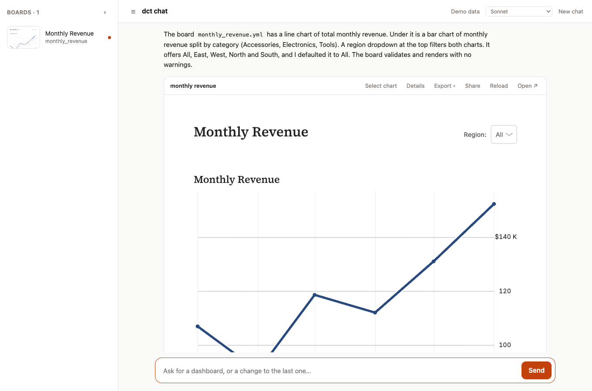

# dct-chat

Describe a dashboard in plain words and Claude builds it. The board appears right in the
conversation, live and filterable, backed by real queries on your data.



It's a small web app on top of [dbt charts](https://github.com/dbt-labs/dbt-charts) (boards are YAML files, rendered by
the `dct` engine) and the Claude Agent SDK. Claude explores the data, writes the board, checks it, fixes
warnings, and hands you the result.

## Get started in five minutes

You need:

- **macOS, Linux or Windows 10/11.** Windows works natively, no WSL needed (see the Windows notes below).
- **[uv](https://docs.astral.sh/uv/)**, which installs Python for you:
  - macOS / Linux: `curl -LsSf https://astral.sh/uv/install.sh | sh`
  - Windows (PowerShell): `powershell -ExecutionPolicy ByPass -c "irm https://astral.sh/uv/install.ps1 | iex"`
- **Git**, to clone the repo.
- **Claude access**, either way works:
  - **Claude Code, logged in.** Install it from [claude.com/claude-code](https://claude.com/claude-code), run `claude` once, and sign in with your Claude account. dct-chat uses that login.
  - **Or an API key** from the [Anthropic Console](https://console.anthropic.com/), which is billed separately by usage. A Claude Pro, Max or Team subscription does *not* include an API key, so if that's what you have, use the Claude Code login above.
  - **Setting the key:** macOS / Linux: `export ANTHROPIC_API_KEY=sk-ant-...`. Windows PowerShell: `$env:ANTHROPIC_API_KEY = "sk-ant-..."`.

```bash
git clone https://github.com/nickteff/dct-chat.git
cd dct-chat
uv sync
uv run dct-chat
```

The terminal prints progress as it starts. Open **http://localhost:8800** when you see the "Open ..." line; the board
server follows a few seconds later and says "Board server ready". **The very first run is slow** (a minute or two):
it installs about 800MB of packages and Python compiles them once. Later starts take a few seconds.

Open **http://localhost:8800** and click one of the suggestions. It ships with a small synthetic
dataset (600 orders, signups, support tickets), so there's nothing else to set up.

> Using a Claude subscription login is fine for running this on your own machine. If you plan to
> put it in front of other people, use an API key and check your plan's terms.

### Windows notes

- Run the commands above in **PowerShell**. Nothing needs WSL.
- **Install Git for Windows.** Claude Code itself needs it on Windows (it's where its own shell runs). Claude Code's setup page lists the current Windows requirements. dct-chat's agent doesn't run shell commands for its work: it writes board files and uses built-in tools to render them and query your data.
- Everything except Claude's own step (the web app, boards, charts, the agent's tools, exports, dbt linking, the safety checks) is tested automatically on Windows, macOS and Linux (`scripts/smoke_test.py`, run by GitHub Actions).

## Things to try

- **Ask for a change.** "Make the trend a bar chart." "Add a KPI row." It edits the existing board.
- **Point at a chart.** Click **Select chart** on a board, click a chart, then say what you want changed.
- **Filter.** The dropdowns on the board work in place.
- **See how it was built.** **Details** shows every query's SQL and row count.
- **Take it with you.** **Export** gives PNG, PDF, HTML or SVG, with your current filters.
- **Stop it.** The Send button turns into **Stop** while it's working.

The model picker (top right) switches between Haiku, Sonnet and Opus. Sonnet is the default.

## Use your own dbt project

```bash
uv run dct-chat --dbt-project /path/to/your/dbt/project
```

Optional: `--target prod` to pick a dbt target, `--profiles-dir DIR` if `profiles.yml` lives elsewhere.

What happens:

- It reads your project and runs `dbt parse` when the manifest is missing or out of date (this writes `target/` and `logs/` inside the project, as dbt normally does).
- Claude is told about your models (marts first), their columns, your sources, and any dbt metrics, and writes `{{ ref('model') }}` instead of table names.
- The header pill shows the connected project. Click it to **Refresh models** or **Test connection**.
- Boards are saved in their own folder here (`workspaces/<project>/`), never in your dbt project.

No dbt project handy? The repo includes a tiny one (a few models of made-up sales data on DuckDB) to try this with:

```bash
cd tests/fixtures/mini_dbt
uv run dbt seed --profiles-dir .
uv run dbt run --profiles-dir .
cd ../..
uv run dct-chat --dbt-project tests/fixtures/mini_dbt
```

(dbt writes a database and `target/`/`logs/` into that folder. They're git-ignored, so nothing gets committed.)

Your warehouse's dbt adapter has to be installed. DuckDB is included. For others:

```bash
uv add "dbt-charts[snowflake]"   # or bigquery, redshift, postgresql, databricks, ...
```

### Before pointing it at real data

- **Query results go to Claude.** When it runs SQL, the rows come back into the conversation. Make sure that's acceptable for the data and any client agreements.
- **It writes its own SQL**, using your profile's credentials. Use a **read-only** role.
- **It's a local tool with no login.** It binds to `127.0.0.1`. Don't expose it on a network.
- Each browser gets its own boards and conversation, and the agent is confined to its own folder. The warehouse connection and query cache are shared.

## How it works

```
browser ──► dct_chat/server.py (FastAPI) ──► Claude Agent SDK session (one per browser)
              │          │                          │ writes board files, calls the tools below
              │          └─ chart engine, loaded once ◄─ render_board, run_query, docs
              └──► `dct serve` (board server, a separate process)
```

- `dct_chat/server.py`: the app: sessions, the agent, board endpoints, the proxy.
- `dct_chat/engine.py` and `dct_chat/tools.py`: the chart engine, loaded once, and the agent's tools that call it directly. (Launching `dct` for each step costs seconds of start-up every time, which adds up to minutes on a slow machine.)
- `dct_chat/project.py`: reads a dbt project and summarizes its manifest for the agent.
- `dct_chat/static/index.html`: the whole UI, no build step.
- `scripts/build_demo_db.py`: regenerates the demo database (`uv run python scripts/build_demo_db.py`).

## Settings

Flags on `dct-chat`, or environment variables:

| Setting | Flag / variable | Default |
|---|---|---|
| dbt project | `--dbt-project` / `DCT_CHAT_DBT_PROJECT` | none (demo data) |
| dbt target | `--target` / `DCT_CHAT_DBT_TARGET` | the profile's default |
| Port | `--port` / `DCT_CHAT_PORT` | 8800 (the board server uses 8801) |
| Model | `DCT_CHAT_MODEL` | `sonnet` |
| Effort | `DCT_CHAT_EFFORT` | `low` (`medium`, `high` think harder, slower) |
| Idle timeout | `DCT_CHAT_SESSION_TTL` | 1800 seconds |

## Troubleshooting

- **"Not logged in" or an authentication error.** Run `claude` once and sign in, or set `ANTHROPIC_API_KEY`.
- **Windows: starting takes a long time every run, not just the first.** Antivirus real-time scanning can slow Python a lot. Watch the terminal: it shows where the time goes. If it's consistently slow, ask whoever manages your machine whether the project folder can be excluded from scanning.
- **Windows: Claude Code won't start.** Install Git for Windows, then restart your terminal.
- **Port already in use.** `uv run dct-chat --port 8900 --preview-port 8901`.
- **"dbt parse failed".** The panel shows dbt's own message. Usually a profile name or target that doesn't match.
- **A board shows an error.** Open **Details**, or just tell Claude what you see.

## Status

A working prototype. The smoke test (`uv run python scripts/smoke_test.py`) covers everything except a live
Claude turn; the agent itself is not under automated test. `uv run python scripts/timing.py` times the building blocks on your machine. The data connection is shared by every
session. See `CLAUDE.md` if you want to work on the code with Claude.
